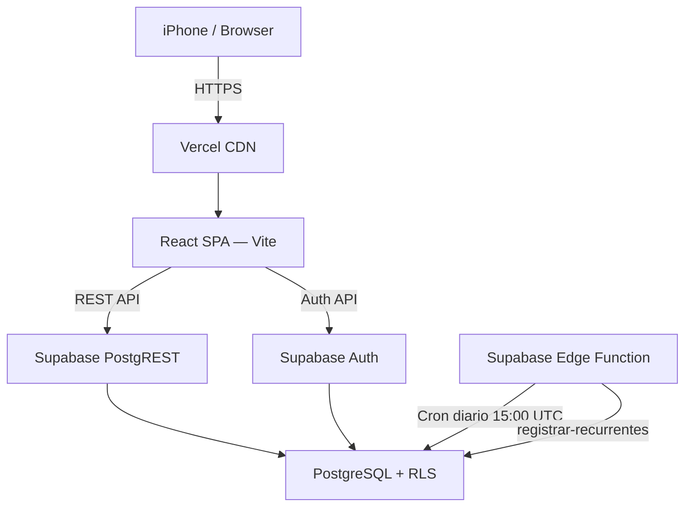
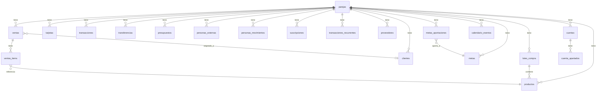
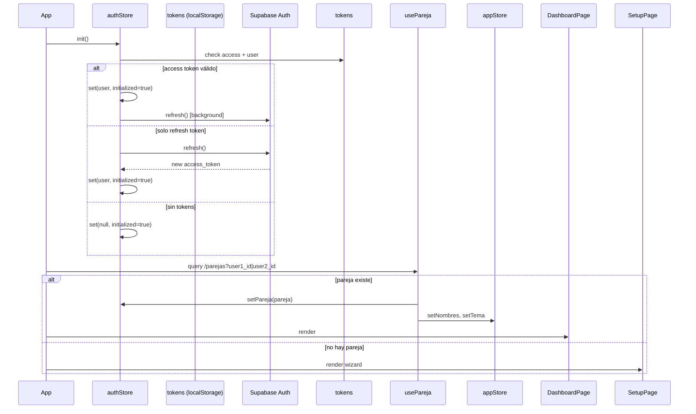

# CLAUDE.md — Nuestro Patrimonio v3.0

> Documento de referencia completo para Claude y futuros desarrolladores.
> Generado el 2026-07-08 a partir del código fuente, migraciones y conversaciones de desarrollo.

---

## Índice

1. [Resumen del proyecto](#1-resumen-del-proyecto)
2. [Arquitectura](#2-arquitectura)
3. [Stack tecnológico](#3-stack-tecnológico)
4. [Estructura del proyecto](#4-estructura-del-proyecto)
5. [Componentes importantes](#5-componentes-importantes)
6. [Hooks personalizados](#6-hooks-personalizados)
7. [Stores (Zustand)](#7-stores-zustand)
8. [Servicios y librerías internas](#8-servicios-y-librerías-internas)
9. [Base de datos](#9-base-de-datos)
10. [Seguridad](#10-seguridad)
11. [Funcionalidades](#11-funcionalidades)
12. [Reglas de negocio](#12-reglas-de-negocio)
13. [Convenciones de código](#13-convenciones-de-código)
14. [Convenciones UI](#14-convenciones-ui)
15. [Convenciones UX](#15-convenciones-ux)
16. [Navegación](#16-navegación)
17. [Flujo de autenticación](#17-flujo-de-autenticación)
18. [APIs y servicios externos](#18-apis-y-servicios-externos)
19. [Variables de entorno y constantes](#19-variables-de-entorno-y-constantes)
20. [Dependencias](#20-dependencias)
21. [Problemas conocidos y deuda técnica](#21-problemas-conocidos-y-deuda-técnica)
22. [Roadmap](#22-roadmap)
23. [Cómo debe trabajar Claude en este proyecto](#23-cómo-debe-trabajar-claude-en-este-proyecto)

---

## 1. Resumen del proyecto

| Campo | Valor |
|-------|-------|
| **Nombre** | Nuestro Patrimonio |
| **Versión** | 3.0.0 |
| **Repositorio** | `AleSGlez/nuestro-patrimonio` |
| **Deploy** | Vercel (rama `main`) |
| **URL Supabase** | `https://kdznaswrbchosmbttskw.supabase.co` |
| **Plataforma objetivo** | iPhone 16 Plus (430px) — también funciona en desktop |

### Objetivo
App de finanzas personales para una **pareja** que comparte gastos y además opera un **negocio de compra-venta de cartas Pokémon**. Gestiona finanzas personales (cuentas, tarjetas, gastos, presupuestos, metas), personas externas (deudas/cobros), y el negocio completo (inventario, compras de Buyee, ventas, clientes).

### Público objetivo
Uso **estrictamente privado** — una sola pareja (Ale y Ruli). No es un producto SaaS.

### Estado del proyecto
**En desarrollo activo.** Fases 1–14 completadas. Ver sección [Funcionalidades](#11-funcionalidades).

---

## 2. Arquitectura



### Frontend
- React 18 SPA construida con Vite
- No hay router entre páginas — todo es un tab system dentro de `DashboardPage`
- PWA configurada con `vite-plugin-pwa` (modo standalone, íconos 192/512px)
- Max width 430px centrado — funciona como app nativa en iPhone

### Backend
- **Supabase** como BaaS completo:
  - Auth (JWT, refresh tokens)
  - PostgreSQL con PostgREST (REST API automática)
  - Row Level Security en todas las tablas
- No hay backend propio — toda la lógica de negocio está en el frontend

### Autenticación
- JWT almacenados en `localStorage` con claves `np_at` (access), `np_rt` (refresh), `np_user`
- Auto-refresh de token en background al cargar la app
- Interceptor de 401 que intenta refresh antes de hacer logout
- Validación de forma del JWT (`token.split('.').length === 3`) antes de guardar

### Hosting
- **Vercel** — deploy automático al hacer push a `main`
- Assets servidos por CDN de Vercel

### Edge Functions
- `supabase/functions/registrar-recurrentes/index.ts`
- **TODO: pendiente de deploy en Supabase Dashboard**
- Propósito: registrar automáticamente suscripciones y transacciones recurrentes vencidas
- Trigger: cron diario a las 15:00 UTC (9am hora México)

---

## 3. Stack tecnológico

| Categoría | Tecnología | Versión | Uso |
|-----------|-----------|---------|-----|
| **Framework UI** | React | 18.3.1 | Base de la app |
| **Build tool** | Vite | 5.4.1 | Dev server, bundler |
| **Estilos** | Tailwind CSS | 3.4.9 | Clases utilitarias |
| **State global** | Zustand | 4.5.4 | Auth + preferencias de app |
| **Server state** | TanStack Query v5 | 5.56.0 | Cache, fetching, mutations |
| **Backend/DB** | Supabase | — | Auth + PostgreSQL + REST |
| **Gráficas** | Recharts | 2.12.7 | BarChart, PieChart, LineChart |
| **Fechas** | date-fns | 3.6.0 | Manipulación y formato de fechas |
| **Fechas TZ** | date-fns-tz | 3.1.3 | Soporte de zonas horarias |
| **Íconos** | lucide-react | 0.427.0 | Íconos SVG |
| **Excel** | xlsx (SheetJS) | 0.18.5 | Import/export de Excel |
| **Formularios** | react-hook-form | 7.53.0 | Instalado pero uso limitado |
| **Validación** | zod | 3.23.8 | Instalado pero uso limitado |
| **Routing** | react-router-dom | 6.26.0 | Instalado pero **no se usa** — la app usa tab system |
| **CN utility** | clsx | 2.1.1 | Classnames condicionales |
| **PWA** | vite-plugin-pwa | 0.20.1 | Service worker, manifest |
| **Edge Functions** | Deno / TypeScript | — | Runtime de Supabase |

---

## 4. Estructura del proyecto

```
nuestro-patrimonio/
├── src/
│   ├── App.jsx                    # Raíz — routing auth/setup/dashboard
│   ├── main.jsx                   # Entry point, QueryClientProvider
│   ├── index.css                  # Tokens de diseño, clases base
│   │
│   ├── modules/                   # Módulos de feature
│   │   ├── accounts/              # Cuentas bancarias + apartados
│   │   │   ├── AccountsPage.jsx
│   │   │   ├── components/
│   │   │   │   ├── FormCuenta.jsx
│   │   │   │   ├── FormApartado.jsx
│   │   │   │   ├── FormTransferencia.jsx
│   │   │   │   ├── CuentaCard.jsx
│   │   │   │   ├── CuentaCardCompact.jsx
│   │   │   │   └── ApartadoNegocioRef.jsx
│   │   │   └── hooks/
│   │   │       ├── useCuentas.js
│   │   │       ├── useApartados.js
│   │   │       └── useTransferencias.js
│   │   │
│   │   ├── auth/                  # Login / registro
│   │   │   └── AuthPage.jsx
│   │   │
│   │   ├── calendario/            # Vista mensual y semanal de eventos
│   │   │   └── CalendarioPage.jsx
│   │   │
│   │   ├── cards/                 # Tarjetas de crédito
│   │   │   ├── CardsPage.jsx
│   │   │   ├── components/
│   │   │   │   ├── FormTarjeta.jsx
│   │   │   │   ├── FormPago.jsx
│   │   │   │   └── TarjetaCard.jsx
│   │   │   └── hooks/
│   │   │       └── useTarjetas.js
│   │   │
│   │   ├── clientes/              # Clientes del negocio Pokémon
│   │   │   ├── ClientesPage.jsx
│   │   │   └── hooks/
│   │   │       └── useClientes.js
│   │   │
│   │   ├── compras/               # Compras de lotes (Buyee) + inventario sync
│   │   │   ├── ComprasPage.jsx
│   │   │   ├── components/
│   │   │   │   └── ImportarCartasLote.jsx
│   │   │   └── hooks/
│   │   │       └── useCompras.js
│   │   │
│   │   ├── couple/                # Setup wizard de pareja
│   │   │   ├── SetupPage.jsx
│   │   │   ├── components/
│   │   │   │   ├── StepInicio.jsx
│   │   │   │   ├── StepNombres.jsx
│   │   │   │   ├── StepIngresos.jsx
│   │   │   │   ├── StepTema.jsx
│   │   │   │   ├── StepInvitar.jsx
│   │   │   │   └── StepUnirse.jsx
│   │   │   └── hooks/
│   │   │       └── usePareja.js
│   │   │
│   │   ├── dashboard/             # Orquestador + componentes de resumen
│   │   │   ├── DashboardPage.jsx  # Shell principal con BottomNav
│   │   │   ├── components/
│   │   │   │   ├── DashboardPersonal.jsx
│   │   │   │   ├── DashboardNegocio.jsx
│   │   │   │   ├── PresupuestosWidget.jsx
│   │   │   │   ├── GraficaFlujo.jsx
│   │   │   │   ├── GraficaCategorias.jsx
│   │   │   │   ├── Sparkline.jsx
│   │   │   │   ├── UltimosMovimientos.jsx
│   │   │   │   ├── PatrimonioCard.jsx
│   │   │   │   └── FlujoCard.jsx
│   │   │   └── hooks/
│   │   │       └── useDashboard.js
│   │   │
│   │   ├── finanzas/              # Hub de finanzas personales (SubNav)
│   │   │   └── FinanzasPage.jsx
│   │   │
│   │   ├── inicio/                # Pantalla de inicio / resumen general
│   │   │   └── InicioPage.jsx
│   │   │
│   │   ├── inventario/            # Inventario de cartas Pokémon
│   │   │   ├── InventarioPage.jsx
│   │   │   ├── components/
│   │   │   │   ├── FormLote.jsx
│   │   │   │   ├── FormProducto.jsx
│   │   │   │   ├── ImportarExcel.jsx
│   │   │   │   └── ProveedoresPage.jsx
│   │   │   └── hooks/
│   │   │       └── useInventario.js
│   │   │
│   │   ├── mas/                   # Configuración, tema, logout
│   │   │   └── MasPage.jsx
│   │   │
│   │   ├── metas/                 # Metas de ahorro
│   │   │   ├── MetasPage.jsx
│   │   │   └── hooks/
│   │   │       └── useMetas.js
│   │   │
│   │   ├── negocio-hub/           # Hub del negocio (SubNav)
│   │   │   ├── NegocioHubPage.jsx
│   │   │   └── PresupuestoNegocioPage.jsx
│   │   │
│   │   ├── personas/              # Personas externas (deudas/cobros)
│   │   │   ├── PersonasPage.jsx
│   │   │   ├── components/
│   │   │   │   ├── FormPersona.jsx
│   │   │   │   └── FormMovimientoPersona.jsx
│   │   │   └── hooks/
│   │   │       └── usePersonas.js
│   │   │
│   │   ├── personas-hub/          # Sub-navegación de personas
│   │   │   └── PersonasHubPage.jsx
│   │   │
│   │   ├── presupuestos/          # Presupuestos personales
│   │   │   ├── PresupuestosPage.jsx
│   │   │   ├── components/
│   │   │   │   └── FormPresupuesto.jsx
│   │   │   └── hooks/
│   │   │       └── usePresupuestos.js
│   │   │
│   │   ├── recurrentes/           # Transacciones recurrentes
│   │   │   ├── RecurrentesPage.jsx
│   │   │   └── hooks/
│   │   │       └── useRecurrentes.js
│   │   │
│   │   ├── reportes/              # Reportes y estadísticas
│   │   │   └── ReportesPage.jsx
│   │   │
│   │   ├── suscripciones/         # Suscripciones recurrentes
│   │   │   ├── SuscripcionesPage.jsx
│   │   │   └── hooks/
│   │   │       └── useSuscripciones.js
│   │   │
│   │   ├── transactions/          # Movimientos (gastos/ingresos)
│   │   │   ├── TransactionsPage.jsx
│   │   │   ├── components/
│   │   │   │   ├── FormTransaccion.jsx
│   │   │   │   └── TransferRow.jsx
│   │   │   └── hooks/
│   │   │       ├── useTransacciones.js
│   │   │       └── useTransferenciasList.js
│   │   │
│   │   └── ventas/                # Ventas del negocio
│   │       ├── VentasPage.jsx
│   │       ├── components/
│   │       │   └── FormVenta.jsx
│   │       └── hooks/
│   │           └── useVentas.js
│   │
│   └── shared/                    # Código compartido
│       ├── components/
│       │   ├── layout/
│       │   │   ├── BottomNav.jsx  # Navegación inferior fija
│       │   │   ├── SubNav.jsx     # Navegación horizontal de tabs
│       │   │   └── PlaceholderPage.jsx
│       │   └── ui/
│       │       ├── Field.jsx      # Input, Select, AmountInput, etc.
│       │       ├── Modal.jsx      # Modal bottom sheet
│       │       ├── Toast.jsx      # Notificaciones toast
│       │       ├── Spinner.jsx
│       │       └── LoadingScreen.jsx
│       ├── hooks/                 # TODO: vacío actualmente
│       ├── lib/
│       │   ├── supabase.js        # Cliente REST + Auth custom
│       │   ├── queryClient.js     # TanStack Query config
│       │   └── utils.js           # Helpers, categorías, reglas de negocio
│       └── store/
│           ├── authStore.js       # Usuario + pareja autenticada
│           └── appStore.js        # Tema, nombres, tab activo
│
├── supabase/
│   └── functions/
│       └── registrar-recurrentes/
│           └── index.ts           # Edge Function (Deno)
│
├── migration_v3_*.sql             # Migraciones de BD ordenadas
├── vite.config.js
├── tailwind.config.js
├── postcss.config.js
├── index.html
└── CLAUDE.md                      # Este archivo
```

---

## 5. Componentes importantes

### Layout

| Componente | Ruta | Descripción |
|-----------|------|-------------|
| `App.jsx` | `src/` | Raíz. Decide: LoadingScreen → AuthPage → SetupPage → DashboardPage |
| `DashboardPage` | `modules/dashboard/` | Shell principal. Renderiza tabs y `BottomNav`. Maneja apertura de modales globales (FormTransaccion, FormTransferencia, FormSuscripcion) |
| `BottomNav` | `shared/components/layout/` | Navegación fija inferior. 5 tabs: Inicio / Finanzas / [+] / Calendario / Negocio. El botón `+` central abre menú de acciones rápidas |
| `SubNav` | `shared/components/layout/` | Scrollable horizontal. Incluye `padding-top: env(safe-area-inset-top)` para Dynamic Island |
| `Modal` | `shared/components/ui/` | Bottom sheet modal. Se usa para todos los formularios |

### UI compartida

| Componente | Descripción |
|-----------|-------------|
| `Input` | Text input con label, manejo de errores |
| `PasswordInput` | Input con toggle mostrar/ocultar |
| `AmountInput` | Input numérico con prefijo `$`, limpia caracteres no numéricos |
| `Select` | Select nativo estilizado con chevron |
| `EmptyState` | Estado vacío con emoji, título, descripción |
| `Toast` | Contexto de notificaciones. Usar `useToast()` |
| `Spinner` | Indicador de carga inline |
| `LoadingScreen` | Pantalla de carga completa |

### Dashboard

| Componente | Descripción |
|-----------|-------------|
| `DashboardPersonal` | Resumen financiero personal. Incluye sub-tabs Pareja/P1/P2 |
| `DashboardNegocio` | Resumen del negocio: capital, utilidad, gastos |
| `PresupuestosWidget` | Mini-widget de presupuestos en el dashboard. Tiene selector Hoy/Semana/Mes |
| `GraficaFlujo` | BarChart de ingresos vs gastos por mes (Recharts) |
| `GraficaCategorias` | PieChart de gastos por categoría (Recharts) |
| `Sparkline` | Línea de tendencia mini (Recharts) |
| `UltimosMovimientos` | Lista de últimas transacciones |

---

## 6. Hooks personalizados

### Auth y pareja
| Hook | Archivo | Descripción |
|------|---------|-------------|
| `usePareja()` | `couple/hooks/usePareja.js` | Carga la pareja del usuario. Setea `authStore.pareja` como efecto secundario |
| `usePerfiles(parejaId)` | mismo | Perfiles de ambos integrantes |

### Cuentas y dinero
| Hook | Archivo | Descripción |
|------|---------|-------------|
| `useCuentas()` | `accounts/hooks/useCuentas.js` | Lista cuentas activas de la pareja |
| `useApartados(cuentaId)` | `accounts/hooks/useApartados.js` | Apartados de una cuenta |
| `useTodosLosApartados()` | mismo | Todos los apartados de todas las cuentas |
| `useTransferirEntreCuentas()` | `accounts/hooks/useTransferencias.js` | Mutación: transferencia entre cuentas |
| `usePagarTarjeta()` | mismo | Mutación: pago de tarjeta desde cuenta |
| `useDisposicionEfectivo()` | mismo | Mutación: retirar efectivo de línea de crédito |
| `useTransferirPersonalNegocio()` | mismo | Mutación: mover dinero entre contextos |
| `useEliminarTransferencia()` | mismo | Mutación: revierte saldos al borrar |

### Tarjetas
| Hook | Archivo | Descripción |
|------|---------|-------------|
| `useTarjetas()` | `cards/hooks/useTarjetas.js` | Lista tarjetas activas |
| `calcularFechasCorte(diaCorte, diaLimitePago)` | mismo | Calcula próximas fechas de corte y límite |
| `diasHasta(fechaISO)` | mismo | Días restantes hasta una fecha |

### Transacciones
| Hook | Archivo | Descripción |
|------|---------|-------------|
| `useTransacciones(filtros)` | `transactions/hooks/useTransacciones.js` | Lista transacciones con filtros opcionales (`contexto`, `mes`) |
| `useCrearTransaccion()` | mismo | Crea tx + aplica efecto en cuenta/tarjeta |
| `useActualizarTransaccion()` | mismo | Revierte efecto anterior, aplica nuevo |
| `useEliminarTransaccion()` | mismo | Revierte efecto + elimina |
| `useTransferenciasList()` | `hooks/useTransferenciasList.js` | Lista historial de transferencias |

### Presupuestos
| Hook | Archivo | Descripción |
|------|---------|-------------|
| `usePresupuestos()` | `presupuestos/hooks/usePresupuestos.js` | Lista todos los presupuestos activos |
| `calcularDisponible(presupuesto, txs)` | mismo | Calcula disponible con roll-over |
| `calcularDesglose(presupuesto)` | mismo | Equivalente diario/semanal del presupuesto |
| `labelPeriodo(tipo)` | mismo | Label legible del tipo de presupuesto |

### Suscripciones y recurrentes
| Hook | Archivo | Descripción |
|------|---------|-------------|
| `useSuscripciones()` | `suscripciones/hooks/useSuscripciones.js` | Lista suscripciones activas (`estado != cancelada`) |
| `useCrearSuscripcion()` | mismo | Crea con `estado: 'activa'` explícito |
| `useRegistrarSuscripcion()` | mismo | Registra cargo + avanza proxima_fecha |
| `siguienteFecha(fecha, frecuencia)` | mismo | Calcula siguiente fecha de recurrencia |
| `diasHasta(fechaStr)` | mismo | Días hasta una fecha |
| `gastoAnual(suscripcion)` | mismo | Gasto anual estimado |
| `useRecurrentes()` | `recurrentes/hooks/useRecurrentes.js` | Lista transacciones recurrentes activas |
| `useRegistrarRecurrente()` | mismo | Registra tx + actualiza cuenta + avanza fecha |

### Inventario y negocio
| Hook | Archivo | Descripción |
|------|---------|-------------|
| `useProductos()` | `inventario/hooks/useInventario.js` | Lista productos activos con stock > 0 |
| `useProveedores()` | mismo | Lista proveedores activos |
| `calcularCostoReal(producto)` | mismo | `precio_unitario_compra + costo_extra_prorrateado` |
| `useVentas()` | `ventas/hooks/useVentas.js` | Lista ventas de la pareja |
| `useRegistrarVenta()` | mismo | Registra venta: descuenta stock, crea tx ingreso, actualiza cuenta |
| `useLotes()` | `compras/hooks/useCompras.js` | Lista lotes de compra |
| `useCrearLote()` | mismo | Crea lote + tx egreso + productos en inventario |
| `useAvanzarEstadoLote()` | mismo | Cambia estado del lote; si llega a `recibido` marca productos como disponibles |
| `useClientes()` | `clientes/hooks/useClientes.js` | Lista clientes activos |
| `useVentasCliente(clienteId)` | mismo | Historial de compras de un cliente |

### Metas
| Hook | Archivo | Descripción |
|------|---------|-------------|
| `useMetas()` | `metas/hooks/useMetas.js` | Lista metas activas |
| `useAportar()` | mismo | Registra aportación: descuenta cuenta, crea tx ahorro, suma a meta, marca completada si alcanzó objetivo |
| `calcularMeta(meta)` | mismo | Calcula pct, faltante, días restantes, cuota mensual/quincenal |

### Dashboard
| Hook | Archivo | Descripción |
|------|---------|-------------|
| `useDashboardData()` | `dashboard/hooks/useDashboard.js` | Agrega txMes y txHistorico para el dashboard |

---

## 7. Stores (Zustand)

### `authStore` (`src/shared/store/authStore.js`)
Estado de sesión. **No persiste** — se rehidrata al cargar.

| Campo | Tipo | Descripción |
|-------|------|-------------|
| `user` | `object\|null` | Usuario de Supabase Auth |
| `pareja` | `object\|null` | Registro de la tabla `parejas` |
| `initialized` | `boolean` | Si ya terminó el proceso de init |

Acciones: `init()`, `login()`, `register()`, `logout()`, `setPareja()`, `setUser()`

### `appStore` (`src/shared/store/appStore.js`)
Preferencias de UI. **Persiste** en `localStorage` como `np-app`.

| Campo | Tipo | Persiste | Descripción |
|-------|------|----------|-------------|
| `tema` | `'violet'\|'emerald'\|'rose'\|'amber'` | ✅ | Tema de color activo |
| `nombres` | `{ p1: string, p2: string }` | ✅ | Nombres personalizados de la pareja |
| `setupCompleto` | `boolean` | ✅ | Si el wizard ya fue completado |
| `tab` | `string` | ❌ | Tab activo del BottomNav |

> **Importante:** `nombres` y `tema` se sobrescriben con los datos reales de BD al cargar `usePareja()`. El localStorage es solo el valor inicial mientras carga.

---

## 8. Servicios y librerías internas

### `supabase.js` — Cliente REST custom

La app **no usa el SDK oficial de Supabase**. Tiene una implementación custom con:

- `auth` — signUp, signIn, signOut, refresh, resetPassword
- `tokens` — get/save/clear de JWT en localStorage
- `db.from(table)` — API CRUD:
  - `.query(params | string)` — SELECT con filtros PostgREST
  - `.insert(data)` — INSERT con `return=representation`
  - `.update(data, match)` — PATCH por match exacto
  - `.upsert(data)` — INSERT OR UPDATE
  - `.delete(match)` — DELETE por match
- `db.rpc(fn, params)` — llamada a función PostgreSQL
- Auto-refresh de JWT en 401

> **Gotcha crítico:** El método `.query()` acepta un objeto `{ col: 'eq.val' }` o un string raw. Para filtros `neq`, `gte`, `lte`, o condiciones compuestas usar **string raw** para evitar problemas de formato.

### `utils.js` — Helpers y constantes

| Export | Tipo | Descripción |
|--------|------|-------------|
| `fmt(amount)` | función | Formatea como MXN con `Intl.NumberFormat` |
| `fmtCompact(amount)` | función | K/M shorthand |
| `fmtDate(date, style)` | función | Formatea fecha en español mexicano |
| `today()` | función | Fecha actual como `YYYY-MM-DD` |
| `currentMonth()` | función | Mes actual como `YYYY-MM` |
| `cn(...args)` | función | Classnames condicionales (wrapper de clsx) |
| `montoParaPersona(tx, persona)` | función | **Ver reglas de negocio §12** |
| `periodoTarjeta(diaCorte, ref?)` | función | **Ver reglas de negocio §12** |
| `quincenasDelMes(año, mes)` | función | **Ver reglas de negocio §12** |
| `CAT_GASTO` | constante | Categorías de gastos personales |
| `CAT_INGRESO` | constante | Categorías de ingresos personales |
| `CAT_NEGOCIO_GASTO` | constante | Categorías de gastos de negocio |
| `CAT_NEGOCIO_INGRESO` | constante | Categorías de ingresos de negocio |
| `getCatEmoji(value, tipo, contexto)` | función | Emoji de una categoría |
| `CONDICIONES` | constante | Estados de cartas (M/NM/LP/MP/HP/DMG) |
| `IDIOMAS` | constante | Idiomas de cartas Pokémon |
| `PALETTE` | constante | Paleta de colores del tema |

### `queryClient.js` — TanStack Query config

```
staleTime:  5 min (default por query)
gcTime:     10 min
retry:      1 intento
refetchOnWindowFocus: true
```

---

## 9. Base de datos

### Diagrama de relaciones



### Tablas

#### `parejas` (tabla base — del schema inicial)
| Columna | Tipo | Descripción |
|---------|------|-------------|
| `id` | UUID PK | ID de la pareja |
| `user1_id` | UUID | Quien creó la pareja (p1) |
| `user2_id` | UUID | Quien se unió (p2) — puede ser null |
| `nombre1` | TEXT | Nombre de p1 |
| `nombre2` | TEXT | Nombre de p2 |
| `tema` | TEXT | Tema visual ('violet', 'emerald', etc.) |
| `codigo_invitacion` | TEXT | Código único para invitar a p2 |

> **Regla de negocio:** `user1_id` = quien creó la pareja = p1. `user2_id` = quien se unió = p2. Esto determina qué nombre mostrar en Configuración.

#### `cuentas`
| Columna | Tipo | Descripción |
|---------|------|-------------|
| `id` | UUID PK | |
| `pareja_id` | UUID FK | |
| `nombre` | TEXT | Nombre de la cuenta |
| `tipo` | TEXT | 'banco', 'efectivo', 'inversión', 'transporte', etc. |
| `persona` | TEXT | 'p1', 'p2', 'negocio' |
| `saldo` | NUMERIC(14,2) | Saldo actual |
| `activa` | BOOLEAN | |

#### `cuenta_apartados`
Bolsas virtuales dentro de una cuenta (el dinero sigue en la cuenta).

| Columna | Tipo | Descripción |
|---------|------|-------------|
| `id` | UUID PK | |
| `cuenta_id` | UUID FK | Cuenta a la que pertenece |
| `pareja_id` | UUID FK | |
| `nombre` | TEXT | Nombre del apartado |
| `emoji` | TEXT | |
| `monto` | NUMERIC(14,2) | Monto asignado al apartado |
| `es_negocio` | BOOLEAN | Si el apartado es parte del capital del negocio |

#### `tarjetas`
| Columna | Tipo | Descripción |
|---------|------|-------------|
| `id` | UUID PK | |
| `pareja_id` | UUID FK | |
| `nombre` | TEXT | |
| `banco` | TEXT | |
| `limite` | NUMERIC(14,2) | Límite de crédito |
| `saldo_total` | NUMERIC(14,2) | Deuda total actual |
| `saldo_periodo_anterior` | NUMERIC(14,2) | Deuda del período anterior (exigible) |
| `gastos_periodo_actual` | NUMERIC(14,2) | Gastos del período vigente |
| `pago_sin_intereses` | NUMERIC(14,2) | Monto definido manualmente por el usuario — NO se modifica al pagar |
| `pago_minimo` | NUMERIC(14,2) | |
| `dia_corte` | INT | Día del mes del corte |
| `dia_limite_pago` | INT | Día del mes límite de pago (corte + 20 días aprox.) |
| `persona` | TEXT | 'p1', 'p2' |
| `color` | TEXT | Color hex para UI |
| `activa` | BOOLEAN | |

#### `transacciones`
| Columna | Tipo | Descripción |
|---------|------|-------------|
| `id` | UUID PK | |
| `pareja_id` | UUID FK | |
| `tipo` | TEXT | 'gasto', 'ingreso' |
| `monto` | NUMERIC(14,2) | |
| `categoria` | TEXT | Ver `CAT_GASTO`, `CAT_INGRESO`, `CAT_NEGOCIO_GASTO`, `CAT_NEGOCIO_INGRESO` |
| `descripcion` | TEXT | |
| `fecha` | DATE | |
| `persona` | TEXT | 'p1', 'p2', 'ambos' |
| `contexto` | TEXT | 'personal', 'negocio' |
| `metodo_pago` | TEXT | **Formato: `"cuenta:UUID"` o `"tarjeta:UUID"`** — necesario para `revertirEfecto` |
| `cuenta_id` | UUID FK | |
| `tarjeta_id` | UUID FK | |

> **CRÍTICO:** `metodo_pago` debe guardarse siempre como `"cuenta:UUID"` o `"tarjeta:UUID"` para que `revertirEfecto()` en `useTransacciones.js` pueda encontrar la cuenta/tarjeta al borrar o editar.

#### `transferencias`
| Columna | Tipo | Descripción |
|---------|------|-------------|
| `tipo` | TEXT | 'entre_cuentas', 'pago_tarjeta', 'disposicion_efectivo', 'personal_a_negocio', 'negocio_a_personal' |
| `monto` | NUMERIC(14,2) | |
| `comision` | NUMERIC(14,2) | Solo en disposición de efectivo |
| `origen_cuenta_id` | UUID FK | |
| `destino_cuenta_id` | UUID FK | |
| `destino_tarjeta_id` | UUID FK | Solo en pago_tarjeta / disposicion_efectivo |

#### `presupuestos`
| Columna | Tipo | Descripción |
|---------|------|-------------|
| `tipo` | TEXT | 'diario', 'semanal', 'mensual' |
| `monto_base` | NUMERIC(14,2) | Límite por período |
| `persona` | TEXT | 'p1', 'p2', 'ambos' |
| `contexto` | TEXT | 'personal', 'negocio' |
| `categoria` | TEXT | Categoría específica (solo negocio) |
| `fecha_inicio` | DATE | Inicio del roll-over |
| `activo` | BOOLEAN | |

#### `suscripciones`
| Columna | Tipo | Descripción |
|---------|------|-------------|
| `estado` | TEXT | 'activa', 'pausada', 'cancelada' — **NO es booleano** |
| `frecuencia` | TEXT | 'diaria', 'semanal', 'mensual', 'bimestral', 'trimestral', 'semestral', 'anual' |
| `proxima_fecha` | DATE | Siguiente fecha de cobro |
| `ultimo_pago_fecha` | DATE | |
| `cuenta_id` | UUID FK | Cuenta de donde se cobra |
| `tarjeta_id` | UUID FK | Tarjeta de donde se cobra |
| `emoji` | TEXT | |

> **Gotcha:** Filtrar con `estado=neq.cancelada` como string raw, NO como objeto `{ estado: 'neq.cancelada' }` — puede fallar dependiendo de la versión del helper.

#### `transacciones_recurrentes`
| Columna | Tipo | Descripción |
|---------|------|-------------|
| `tipo` | TEXT | 'gasto', 'ingreso' |
| `frecuencia` | TEXT | Igual que suscripciones |
| `proxima_fecha` | DATE | |
| `activa` | BOOLEAN | (a diferencia de suscripciones, usa booleano) |
| `cuenta_id` | UUID FK | |

#### `personas_externas`
| Columna | Tipo | Descripción |
|---------|------|-------------|
| `saldo` | NUMERIC(14,2) | Positivo = me debe; Negativo = le debo |

#### `personas_movimientos`
| Columna | Tipo | Descripción |
|---------|------|-------------|
| `tipo` | TEXT | 'prestamo', 'le_debo', 'pago_recibido', 'pago_enviado' |

> **Nota:** Se eliminó el tipo 'cobro' y fue reemplazado por 'le_debo' en `migration_v3_5b_personas_fix.sql`.

#### `proveedores`
| Columna | Descripción |
|---------|-------------|
| `plataforma` | 'Buyee', 'MercadoLibre', etc. |

#### `lotes_compra`
| Columna | Tipo | Descripción |
|---------|------|-------------|
| `monto_total_jpy` | NUMERIC | Precio en yenes japoneses |
| `tipo_cambio` | NUMERIC(10,4) | JPY → MXN |
| `costo_envio` | NUMERIC(14,2) | En MXN |
| `costo_aduana` | NUMERIC(14,2) | En MXN |
| `estado` | TEXT | 'pagado', 'en_almacen_buyee', 'enviado_mexico', 'en_aduana', 'recibido' |
| `tipo` | TEXT | 'buyee', 'individual', 'otro' |
| `cuenta_id` | UUID FK | De donde salió el dinero |
| `metodo_pago` | TEXT | 'transferencia', 'efectivo', 'tarjeta_personal', 'paypal', 'otro' |
| `transaccion_id` | UUID | TX de egreso vinculada |

#### `productos`
| Columna | Tipo | Descripción |
|---------|------|-------------|
| `nombre_jp` | TEXT | Nombre en japonés |
| `nombre_en` | TEXT | Nombre en inglés |
| `serie` | TEXT | Ej: 'Base Set', 'Scarlet & Violet' |
| `numero_carta` | TEXT | Ej: '025/198' |
| `idioma` | TEXT | 'JP', 'EN', 'ES', etc. |
| `condicion` | TEXT | 'mint', 'near_mint', 'played', 'damaged' |
| `cantidad_compra` | INT | Unidades compradas |
| `cantidad_stock` | INT | Stock disponible (se descuenta al vender) |
| `precio_unitario_compra` | NUMERIC | Precio de compra por carta |
| `precio_venta` | NUMERIC | Precio de venta configurado |
| `costo_extra_prorrateado` | NUMERIC | (envío + aduana) / total cartas del lote |
| `estado` | TEXT | 'disponible', 'en_transito', 'vendido', 'apartado' |
| `activo` | BOOLEAN | |

> **Costo real = `precio_unitario_compra + costo_extra_prorrateado`** — se usa para calcular ganancia.

#### `ventas`
| Columna | Tipo | Descripción |
|---------|------|-------------|
| `metodo_cobro` | TEXT | 'efectivo', 'transferencia', 'mercadolibre', 'paypal', 'otro' |
| `comision_pct` | NUMERIC(5,2) | ML: 13.25%, PayPal: 4.4% |
| `comision_monto` | NUMERIC | Calculado al registrar |
| `ganancia` | NUMERIC | `total_venta - total_costo - comision` |
| `transaccion_id` | UUID | TX de ingreso vinculada |

#### `ventas_items`
| Columna | Descripción |
|---------|-------------|
| `costo_unitario` | `precio_unitario_compra + costo_extra_prorrateado` al momento de vender |
| `ganancia_item` | `subtotal - (costo_unitario * cantidad)` |

#### `clientes`
| Columna | Descripción |
|---------|-------------|
| `wishlist` | Texto libre: cartas que busca, sets de interés, pedidos especiales |

#### `metas`
| Columna | Descripción |
|---------|-------------|
| `monto_actual` | Se actualiza al hacer aportaciones |
| `completada` | Se marca automáticamente cuando `monto_actual >= monto_objetivo` |
| `cuenta_id` | Cuenta predeterminada (opcional) |
| `color` | Color hex — **requiere `migration_v3_12_metas.sql` + ALTER TABLE** |

#### `metas_aportaciones`
Cada aportación crea también una transacción de gasto en categoría 'ahorro'.

#### `calendario_eventos`
Tabla para eventos manuales. Los eventos automáticos (quincenas, cortes, suscripciones) se generan en el frontend, no se guardan en BD.

---

## 10. Seguridad

### Row Level Security (RLS)
**Todas las tablas tienen RLS activado.**

El patrón de policy es universal:
```sql
FOR ALL USING (
  pareja_id IN (
    SELECT id FROM parejas
    WHERE user1_id = auth.uid() OR user2_id = auth.uid()
  )
)
```

### Autenticación
- Supabase Auth con email/password
- JWTs con validación de forma antes de guardar (`isJWT()`)
- Refresh automático antes de expirar
- Al expirar sin refresh posible: `tokens.clear()` + evento `np:logout`

### Autorización
- Toda la autorización está delegada a RLS en PostgreSQL
- No hay lógica de autorización en el frontend más allá de verificar `user !== null`

### Validaciones client-side
- Campos requeridos en formularios
- Montos > 0
- Fechas válidas
- Cantidades dentro de rango (ej: cantidad_compra ≤ cantidad_stock)

---

## 11. Funcionalidades

| Fase | Módulo | Estado | Notas |
|------|--------|--------|-------|
| 1 | Auth + Login + Registro | ✅ Completo | |
| 2 | Setup Wizard (5 pasos) + código invitación | ✅ Completo | |
| 3 | Cuentas (CRUD) + Apartados + tipos | ✅ Completo | |
| 3 | Tarjetas de crédito (CRUD, pago, período) | ✅ Completo | |
| 4 | Transacciones (gasto/ingreso) + editar + eliminar | ✅ Completo | |
| 4 | Transferencias (5 tipos) | ✅ Completo | |
| 4 | Disposición de efectivo | ✅ Completo | |
| 4.5 | Personas externas (deudas, cobros) | ✅ Completo | |
| 5 | Dashboard personal (Pareja/P1/P2 con sparklines) | ✅ Completo | |
| 6 | Dashboard negocio | ✅ Completo | |
| 7 | Presupuestos con roll-over (diario/semanal/mensual) | ✅ Completo | |
| 8 | Inventario Pokémon (lotes, cartas, Excel, proveedores) | ✅ Completo | |
| 9 | Suscripciones con alertas y método de pago | ✅ Completo | |
| 9 | Transacciones recurrentes | ✅ Completo | |
| 10 | Calendario (quincenas, cortes, pagos, suscripciones) | ✅ Completo | |
| 11 | Metas de ahorro (aportaciones, cuota sugerida) | ✅ Completo | |
| 12 | Ventas del negocio (multi-carta, comisiones ML/PayPal) | ✅ Completo | |
| 12 | Clientes con wishlist e historial | ✅ Completo | |
| 13 | Reportes (personal + negocio, export Excel) | ✅ Completo | |
| 13 | Presupuesto de negocio por categoría | ✅ Completo | |
| 14 | Compras de lotes Buyee con tracking de estado | ✅ Completo | |
| — | Navegación "Espacios Inteligentes" (5 tabs) | ✅ Completo | |
| — | Edge Function registro automático recurrentes | ⚠️ Parcial | Código listo, falta deploy en Supabase |
| — | Fix espacio negro nav iPhone | ⏳ Pendiente | |
| — | Búsqueda global | ⏳ Pendiente | |
| — | Backup/Export total | ⏳ Pendiente | |
| — | PWA polish (íconos, splash) | ⏳ Pendiente | Los íconos 192/512px no están creados |
| — | Modo demo | ⏳ Pendiente | |
| — | Cotizador Collectr API | ⏳ Pendiente | Requiere suscripción API de getcollectr.com |
| — | Notificaciones push nativas | ⏳ Pendiente | |

---

## 12. Reglas de negocio

### Gastos compartidos al 50%
```js
// utils.js — montoParaPersona(tx, persona)
// Si la tx es 'ambos' y se filtra por p1 o p2 específico → cuenta al 50%
// Si la tx es de la persona específica → cuenta al 100%
// Si el filtro es 'ambos' → siempre 100%
```

### Período de tarjeta de crédito
```
- Período corre desde el día después del corte anterior hasta el día de corte actual
- Ejemplo: corte día 7 → período del 8 del mes anterior al 7 del mes actual
- El día de corte SÍ entra en el período actual (inclusive)
```

### Día límite de pago
```
- Siempre es corte + 20 días aproximadamente
- Se calcula relativo al ÚLTIMO corte (el que ya pasó), no al próximo
- Ejemplo: corte 7 julio → límite 27 julio (no 27 agosto)
- En FormTarjeta se auto-calcula al ingresar dia_corte
```

### Pago de tarjeta sin intereses
```
- pago_sin_intereses es un campo que el usuario define MANUALMENTE
- NO se modifica al hacer pagos
- Al pagar: solo reducen saldo_total y saldo_periodo_anterior
```

### Quincenas ajustadas
```js
// Si el día 15 o 30 cae en sábado, domingo o festivo mexicano
// → retrocede al día hábil anterior
// Festivos fijos: 1-ene, 5-feb, 21-mar, 1-may, 16-sep, 20-nov, 25-dic
```

### Presupuestos con roll-over
```
disponible = (monto_base × períodos_transcurridos) - total_gastado_desde_fecha_inicio
```
Sin cron jobs — se calcula en el frontend con todas las transacciones desde `fecha_inicio`.

### Costo real de una carta
```
costo_real = precio_unitario_compra + costo_extra_prorrateado
costo_extra_prorrateado = (costo_envio + costo_aduana) / total_cartas_del_lote
```

### Ganancia de una venta
```
ganancia = total_venta - total_costo - comision_plataforma
comision_ml = 13.25%
comision_paypal = 4.4%
```

### Capital del negocio
```
capital_negocio = cuentas con persona='negocio' + apartados con es_negocio=true
```

### Patrimonio personal
```
patrimonio = suma(saldos de cuentas personales) - suma(saldo_total de tarjetas)
```

### Revertir transacción al eliminar
```
metodo_pago="cuenta:UUID" → devolver monto a la cuenta
metodo_pago="tarjeta:UUID" → reducir saldo_total y gastos_periodo_actual de la tarjeta
metodo_pago="apartado:UUID:cuentaUUID" → devolver monto al apartado (NO a la cuenta)
```

### Apartados como fuente de pago
```
Al pagar con un apartado:
1. Se reduce el monto del apartado
2. Se usa la cuenta del apartado como origen del pago
3. NO se descuenta doblemente de la cuenta
```

### Personas externas
```
saldo > 0 → persona me debe
saldo < 0 → yo le debo
tipos: prestamo (me sube), le_debo (me sube), pago_recibido (me baja), pago_enviado (me baja)
```

### Estado de productos en inventario
```
en_transito → cuando el lote aún no ha llegado
disponible  → cuando el lote fue marcado como 'recibido'
vendido     → al registrar una venta (TODO: actualmente no se actualiza automáticamente)
```

---

## 13. Convenciones de código

### General
- Todo en **español** — nombres de variables, comentarios, UI
- Componentes en **PascalCase**, hooks en **camelCase** con prefijo `use`
- Archivos `.jsx` para componentes, `.js` para hooks y utilidades
- Imports con alias: `@modules`, `@shared`, `@ui`, `@lib`, `@store`, `@hooks`

### Componentes
- **Nunca definir componentes dentro de otros componentes** — causa bugs de unmount en iOS (lección aprendida de v1/v2)
- Todos los componentes al nivel raíz del módulo o en carpeta `components/`
- Props desestructuradas en la firma
- Valores por defecto con `= []` o `= {}` en props de hooks

### Hooks de datos
```js
// Patrón estándar:
export function useMiRecurso() {
  const parejaId = useAuthStore((s) => s.pareja?.id)
  return useQuery({
    queryKey: ['recurso', parejaId],
    queryFn: () => db.from('tabla').query(`pareja_id=eq.${parejaId}&...`),
    enabled: !!parejaId,
    staleTime: 1000 * 60 * 2,
  })
}
```

### Mutations
```js
// Patrón estándar:
export function useCrearRecurso() {
  const qc = useQueryClient()
  const parejaId = useAuthStore((s) => s.pareja?.id)
  return useMutation({
    mutationFn: async (data) => { ... },
    onSuccess: () => {
      qc.invalidateQueries({ queryKey: ['recurso', parejaId] })
      // Invalidar también tablas relacionadas que cambian
    },
  })
}
```

### Formato de metodo_pago
```js
// SIEMPRE guardar con prefijo:
metodo_pago: `cuenta:${cuentaId}`
metodo_pago: `tarjeta:${tarjetaId}`
metodo_pago: `apartado:${apartadoId}:${cuentaOrigenId}`
// NUNCA: metodo_pago: 'cuenta' (sin UUID)
```

### Estado de saldos
- **Nunca mutar el estado local** — siempre leer desde la BD, calcular nuevo valor, hacer PATCH
- Después de una mutación con `onSuccess`: `qc.invalidateQueries()` para refrescar

---

## 14. Convenciones UI

### Temas
4 temas de color disponibles: `violet` (default), `emerald`, `rose`, `amber`.
El color del tema controla `--accent`, `--accent-light`, `--accent-muted`.

### Paleta base

| Token | Valor | Uso |
|-------|-------|-----|
| `surface-950` | `#09090E` | Fondo más oscuro |
| `surface-900` | `#0F0F14` | Fondo principal, headers, nav |
| `surface-800` | `#15151C` | Cards |
| `surface-700` | `#1C1C26` | Inputs, elementos internos |
| `surface-600` | `#24242F` | Hover states |
| `ok` | `#22C55E` | Verde — ingresos, positivo |
| `warn` | `#F59E0B` | Amarillo — alertas |
| `bad` | `#EF4444` | Rojo — gastos, errores, negativo |
| `info` | `#3B82F6` | Azul — información |

### Clases CSS principales

| Clase | Uso |
|-------|-----|
| `.card` | Contenedor con fondo `surface-800` y borde sutil |
| `.card-interactive` | Card con hover y tap feedback |
| `.page` | Wrapper scrollable. Incluye padding-bottom para el nav |
| `.bottom-nav` | Nav fija inferior con safe area |
| `.top-header` | Header fijo superior con safe area |
| `.fab` | Floating action button (bottom-right) |
| `.btn-primary` | Botón con color accent |
| `.btn-ghost` | Botón secundario translúcido |
| `.btn-danger` | Botón destructivo en rojo |
| `.input` | Input estilizado con focus en accent |
| `.label` | Label uppercase gris |
| `.badge-ok/warn/bad/accent/muted` | Badges de estado |
| `.money-pos/money-neg/money` | Textos monetarios |
| `.section-label` | Label de sección en caps |
| `.skeleton` | Placeholder de carga |
| `.glass` | Efecto glass |

### Tipografía
- Sans: `Inter` → textos generales
- Mono: `JetBrains Mono` → cantidades, montos, códigos

### iOS / Safe areas
```css
/* Dynamic Island: siempre usar inline style, no clase */
style={{ paddingTop: 'calc(env(safe-area-inset-top, 0px) + 20px)' }}

/* Layout raíz */
height: 100svh; position: fixed;  /* evita bug de altura en Safari */

/* Inputs: font-size mínimo 16px para evitar zoom en iOS */
.input { font-size: 16px; }

/* Flex containers con scroll: siempre agregar min-h-0 */
.flex-1.flex.flex-col.overflow-hidden { min-height: 0; }
```

---

## 15. Convenciones UX

### Navegación
- Sin page transitions — cambio instantáneo de tabs
- Bottom nav fijo siempre visible
- SubNav horizontal scrollable — no se ve cortado en móvil
- Modales como bottom sheets (slide desde abajo)

### Feedback
- Toasts para confirmaciones y errores (duran ~3s)
- `active:scale-[0.98]` en elementos interactivos para tap feedback
- Skeletons mientras cargan datos

### Formularios
- Validación básica client-side antes de submit
- Botón de submit muestra Spinner mientras carga
- Error como Toast (no inline) para la mayoría de errores
- `autoFocus` en el primer campo al abrir un modal

### Vacíos
- Siempre mostrar `EmptyState` con emoji + título + descripción cuando no hay datos

### Dinero
- Siempre formatear con `fmt()` — locale `es-MX`, símbolo `$`, 2 decimales
- Verde (`text-ok`) para ingresos/positivo
- Rojo (`text-bad`) para gastos/negativo/deuda
- Blanco para valores neutrales

---

## 16. Navegación

### Diagrama de navegación

```
App
├── LoadingScreen (mientras inicializa)
├── AuthPage (si no hay sesión)
├── SetupPage (si hay sesión pero no hay pareja)
│   ├── StepInicio
│   ├── StepNombres
│   ├── StepIngresos
│   ├── StepTema
│   ├── StepInvitar (crear pareja nueva)
│   └── StepUnirse (unirse con código)
└── DashboardPage (si hay pareja)
    ├── BottomNav [Inicio | Finanzas | (+) | Calendario | Negocio]
    │
    ├── InicioPage
    │   └── Grid: Mi patrimonio | Pareja | Negocio | Personas
    │
    ├── FinanzasPage [SubNav]
    │   ├── Resumen (DashboardPersonal)
    │   │   └── Sub-tabs: Pareja | P1 | P2
    │   ├── Cuentas
    │   ├── Tarjetas
    │   ├── Movimientos
    │   ├── Presupuestos
    │   ├── Metas ⭐
    │   ├── Suscripciones 🔄
    │   ├── Recurrentes 🔁
    │   ├── Personas 👥
    │   └── Reportes 📈
    │       └── Sub-tabs: Personal | Negocio
    │
    ├── CalendarioPage
    │   └── Vista mensual / semanal
    │       └── Eventos: quincenas, cortes, pagos, suscripciones
    │
    └── NegocioHubPage [SubNav]
        ├── Resumen (DashboardNegocio)
        ├── Ventas 💰
        ├── Inventario 📦
        ├── Clientes 👤
        ├── Presupuesto 🎯
        └── Compras 🛒

Botón (+) central → menú flotante:
    ├── Gasto → FormTransaccion (tipo=gasto)
    ├── Ingreso → FormTransaccion (tipo=ingreso)
    ├── Transferencia → FormTransferencia
    └── Suscripción → FormSuscripcionGlobal
```

### Restricciones de navegación
- **Máximo 5 tabs en BottomNav** — nuevas features van como sub-tabs
- Los sub-tabs de cada hub tienen scroll horizontal
- `SubNav` incluye `padding-top: env(safe-area-inset-top)` para Dynamic Island
- Los wrappers de SubNav requieren `flex-1 flex flex-col overflow-hidden min-h-0` para que el scroll funcione en iOS

---

## 17. Flujo de autenticación



### Refresh automático
- `apiFetch` intercepta 401 y llama `auth.refresh()` antes de hacer logout
- Al expirar: `tokens.clear()` + `window.dispatchEvent(new Event('np:logout'))`
- `App.jsx` escucha `np:logout` y llama `logout()` del store

---

## 18. APIs y servicios externos

### Supabase PostgREST
- **URL:** `https://kdznaswrbchosmbttskw.supabase.co/rest/v1/`
- Headers requeridos: `apikey`, `Authorization: Bearer {token}`, `Prefer: return=representation`
- Filtros PostgREST: `col=eq.val`, `col=neq.val`, `col=gte.val`, `col=lte.val`
- Para `OR`: usar string raw `or=(col1.eq.x,col2.eq.y)` con paréntesis obligatorios

### Supabase Auth
- **URL:** `https://kdznaswrbchosmbttskw.supabase.co/auth/v1/`
- Endpoints usados: `/signup`, `/token?grant_type=password`, `/token?grant_type=refresh_token`, `/logout`, `/recover`

### Cotizador Collectr (PENDIENTE)
- TODO: Requiere suscripción a `getcollectr.com/api`
- Propósito: precios de mercado de cartas Pokémon en tiempo real
- Alternativa evaluada: pokemontcg.io (gratuita, datos de TCGPlayer)

---

## 19. Variables de entorno y constantes

### Variables de entorno (`.env.local`)
```
VITE_SUPABASE_URL=https://kdznaswrbchosmbttskw.supabase.co
VITE_SUPABASE_ANON_KEY=<anon_key>
```

### Aliases de Vite
```js
'@'        → src/
'@modules' → src/modules/
'@shared'  → src/shared/
'@ui'      → src/shared/components/ui/
'@lib'     → src/shared/lib/
'@store'   → src/shared/store/
'@hooks'   → src/shared/hooks/
```

### Tokens de localStorage
```
np_at   → access token (JWT)
np_rt   → refresh token
np_user → user object serializado
np-app  → estado de appStore persistido
```

### Constantes de diseño
```css
--nav-height:    64px
--header-height: 60px
Max width:       430px (iPhone 16 Plus)
```

### Festivos fijos México
`01-01, 02-05, 03-21, 05-01, 09-16, 11-20, 12-25`

---

## 20. Dependencias

| Paquete | Versión | Para qué se usa |
|---------|---------|-----------------|
| `react` | 18.3.1 | Framework UI |
| `react-dom` | 18.3.1 | Renderizado DOM |
| `@tanstack/react-query` | 5.56.0 | Cache de server state, fetching, mutations |
| `zustand` | 4.5.4 | Estado global (auth + preferencias) |
| `recharts` | 2.12.7 | BarChart, LineChart, PieChart en dashboards |
| `date-fns` | 3.6.0 | Manipulación de fechas, diferencias, format |
| `date-fns-tz` | 3.1.3 | Zonas horarias (instalado, uso limitado) |
| `lucide-react` | 0.427.0 | Íconos SVG |
| `xlsx` | 0.18.5 | Import/export de Excel (.xlsx) |
| `clsx` | 2.1.1 | Classnames condicionales |
| `react-hook-form` | 7.53.0 | Instalado, uso muy limitado (mayoría es estado local) |
| `zod` | 3.23.8 | Instalado, uso muy limitado |
| `react-router-dom` | 6.26.0 | Instalado pero **no se usa** — tab system interno |
| `vite` | 5.4.1 | Build tool y dev server |
| `@vitejs/plugin-react` | 4.3.1 | Plugin React para Vite |
| `tailwindcss` | 3.4.9 | Estilos utilitarios |
| `vite-plugin-pwa` | 0.20.1 | Service worker y PWA manifest |
| `autoprefixer` | 10.4.20 | PostCSS autoprefixer |
| `postcss` | 8.4.41 | Procesador CSS |

---

## 21. Problemas conocidos y deuda técnica

### Bugs conocidos
| Bug | Estado | Descripción |
|-----|--------|-------------|
| Espacio negro bajo nav en iPhone | ⏳ Pendiente | `env(safe-area-inset-bottom)` no se aplica correctamente en algunos casos |
| Íconos PWA | ⏳ Pendiente | `icon-192.png` e `icon-512.png` no existen en `/public` — warnings en consola |
| `react-router-dom` instalado sin uso | Deuda técnica | Dependencia innecesaria de 26KB |
| `react-hook-form` + `zod` poco usados | Deuda técnica | Estado de formularios mayormente en `useState` local |

### Migraciones con discrepancias BD
Algunas columnas se crearon en migraciones incrementales por diferencias entre el schema inicial de la BD y el schema del código:
- `metas.color` — requiere `ALTER TABLE metas ADD COLUMN color TEXT`
- `metas.descripcion` — requiere `ALTER TABLE metas ADD COLUMN descripcion TEXT`
- `clientes.nota` — requiere `ALTER TABLE`
- `proveedores.nota, url, activo, plataforma` — requieren `ALTER TABLE`
- `productos.cantidad_compra` y otras — requieren `ALTER TABLE`
- `presupuestos.categoria, contexto` — requieren `ALTER TABLE`

> **Regla:** Siempre que aparezca "could not find the 'X' column in the schema cache", la columna no existe en la BD. Agregar con `ALTER TABLE nombre ADD COLUMN IF NOT EXISTS`.

### Deuda técnica
| Item | Descripción |
|------|-------------|
| Edge Function sin deploy | `supabase/functions/registrar-recurrentes` está lista pero no deployada |
| Estado de producto no actualiza a 'vendido' | Al vender, `cantidad_stock` sí baja pero `estado` no cambia a 'vendido' cuando llega a 0 |
| `metodo_pago` legado | Transacciones antiguas pueden tener `metodo_pago='cuenta'` sin UUID. `revertirEfecto` maneja el caso legacy, pero es frágil |
| Venta sin cuenta | Si se registra una venta sin cuenta destino, no se crea la transacción de ingreso |
| `react-router-dom` innecesario | Puede removerse del package.json |

---

## 22. Roadmap

| Prioridad | Feature | Descripción |
|-----------|---------|-------------|
| Alta | Deploy Edge Function | `registrar-recurrentes` + configurar cron en Supabase |
| Alta | Fix nav iPhone | Espacio negro bajo el bottom nav |
| Media | Cotizador Collectr | Precios de mercado en inventario (requiere suscripción API) |
| Media | Búsqueda global | Un buscador que encuentre en transacciones, cartas, clientes, personas |
| Media | Backup/Export total | Exportar toda la BD a Excel |
| Media | PWA polish | Crear íconos 192/512px reales, splash screen |
| Baja | Modo demo | Login demo con datos de ejemplo |
| Baja | Notificaciones push nativas | Requiere service worker avanzado |
| Baja | Realtime sync | Supabase Realtime para ver cambios del otro usuario en tiempo real |

---

## 23. Cómo debe trabajar Claude en este proyecto

### Principios generales

1. **Leer antes de escribir.** Antes de cualquier cambio, ver el archivo completo con `view`. El contexto histórico puede estar desactualizado.

2. **Cambios quirúrgicos, no rewrites.** Preferir `str_replace` sobre reescribir archivos completos. Solo reescribir cuando el cambio afecte >60% del archivo.

3. **No romper arquitectura.** Respetar la separación en módulos. No mover lógica de negocio al componente si ya existe un hook. No crear componentes dentro de otros componentes (bug crítico de iOS).

4. **Verificar build.** Siempre correr `npx vite build` después de cambios y resolver errores antes de entregar.

5. **Un archivo a la vez.** Hacer `view` justo antes de cada `str_replace`. Un `str_replace` exitoso invalida los `view` anteriores del mismo archivo.

### Reglas de código

6. **`metodo_pago` siempre con UUID.** Formato: `"cuenta:UUID"` o `"tarjeta:UUID"`. Nunca `"cuenta"` sin UUID.

7. **`min-h-0` en flex containers con scroll.** Cualquier `div` con `flex-1 flex flex-col overflow-hidden` que contenga contenido scrolleable necesita `min-h-0`.

8. **Safe area en headers de módulo.** Los headers que están debajo del Dynamic Island necesitan `style={{ paddingTop: 'calc(env(safe-area-inset-top, 0px) + 20px)' }}`.

9. **`SubNav` incluye safe area.** Cuando se agrega un `SubNav` a un módulo, ya incluye el `padding-top` de safe area internamente. No duplicar.

10. **Queries string raw para filtros complejos.** Para `neq`, `gte`, `lte`, `or`, usar string en `.query('...')` en lugar de objeto.

### Reglas de negocio

11. **No modificar `pago_sin_intereses` al pagar.** Solo reducir `saldo_total` y `saldo_periodo_anterior`.

12. **Suscripciones usan columna `estado`**, no booleano `activa`. Filtrar con `estado=neq.cancelada`.

13. **Capital negocio = cuentas negocio + apartados `es_negocio=true`.**

14. **Costo real = `precio_unitario_compra + costo_extra_prorrateado`.**

15. **Al eliminar una tx**: leer `metodo_pago` para saber dónde revertir. No asumir que siempre hay `cuenta_id`.

### Base de datos

16. **Si hay error "column not found"**, agregar con `ALTER TABLE tabla ADD COLUMN IF NOT EXISTS ...` en Supabase SQL Editor. No asumir que todas las columnas de las migraciones fueron aplicadas.

17. **Siempre RLS.** Al crear una nueva tabla, incluir `ENABLE ROW LEVEL SECURITY` y la policy con el patrón estándar de `pareja_id IN (SELECT id FROM parejas WHERE ...)`.

18. **No usar el SDK oficial de Supabase.** Usar el cliente custom en `src/shared/lib/supabase.js`.

### UI / UX

19. **Todos los formularios en Modals** (bottom sheet). Usar el componente `Modal` de `@ui/Modal`.

20. **Siempre mostrar `EmptyState`** cuando no hay datos.

21. **Toasts para feedback** — `useToast()` de `@ui/Toast`.

22. **Montos siempre con `fmt()`** — nunca mostrar números crudos.

23. **Colores semánticos:** `text-ok` (verde/ingresos), `text-bad` (rojo/gastos/error), `text-warn` (amarillo/alerta).

### Qué NO hacer

- ❌ No definir componentes dentro de funciones de render (bug crítico iOS)
- ❌ No llamar `setState` durante el render
- ❌ No mutar directamente un objeto de `useState` — siempre usar el setter
- ❌ No usar `100vh` — usar `100svh` con `position:fixed`
- ❌ No agregar un 6to tab al BottomNav — máximo 5
- ❌ No crear endpoints ni lógica de backend — todo en Supabase + RLS
- ❌ No inventar columnas de BD — verificar antes que existan
- ❌ No usar el SDK de Supabase — usar el cliente custom

### Comandos útiles

```powershell
# Desarrollo
cd np && npm run dev
npm run dev -- --host   # Para probar en iPhone en la misma red

# Build
npm run build

# Git
git add . && git commit -m "mensaje" && git push origin main
```

### Flujo de cambio típico

1. Entender el cambio pedido
2. `view` el/los archivos afectados
3. Hacer `str_replace` quirúrgico
4. Si hay nuevas tablas: generar SQL de migración
5. `npx vite build` — resolver errores
6. Empaquetar como `.tar.gz` y entregar
7. Esperar confirmación de que funciona en iPhone antes de hacer commit

---

*Documento generado el 2026-07-08. Mantener actualizado al agregar nuevas fases o cambios arquitecturales significativos.*
