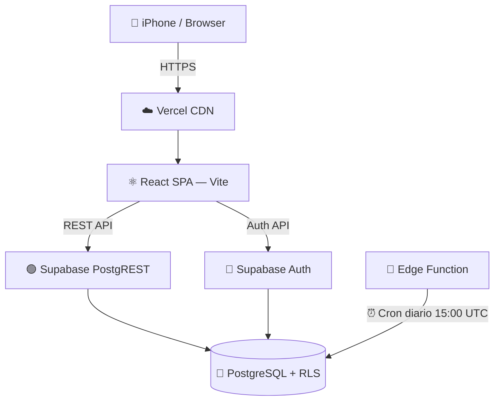

<div align="center">

# 💰 Nuestro Patrimonio

### App de finanzas personales para pareja + negocio de compra-venta de cartas Pokémon 🎴


🔗 **[nuestras-finanzas-bice.vercel.app](https://nuestras-finanzas-bice.vercel.app)**

</div>

---

## 📖 Sobre el proyecto

**Nuestro Patrimonio** es una PWA privada, pensada para el uso **exclusivo de una pareja**, que centraliza:

- 💵 Finanzas personales compartidas (cuentas, tarjetas, gastos, presupuestos, metas)
- 🤝 Deudas y cobros con personas externas
- 🎴 Un negocio de compra-venta de cartas Pokémon (inventario, compras vía Buyee, ventas, clientes)

> 🔒 Uso estrictamente privado — no es un producto SaaS. Optimizado para **iPhone 16 Plus (430px)**, aunque también funciona en desktop.

---

## ✨ Funcionalidades

| Módulo | Descripción |
|---|---|
| 🏦 **Cuentas** | Bancos, efectivo, inversiones + apartados virtuales |
| 💳 **Tarjetas** | Control de cortes, pagos, límites y período |
| 🔁 **Movimientos** | Gastos e ingresos, transferencias entre cuentas |
| 📊 **Presupuestos** | Roll-over automático diario / semanal / mensual |
| 🎯 **Metas de ahorro** | Aportaciones, cuota sugerida y progreso |
| 🔄 **Suscripciones** | Alertas de cobro y método de pago |
| 🔂 **Recurrentes** | Transacciones automáticas programadas |
| 👥 **Personas** | Control de deudas y cobros externos |
| 📅 **Calendario** | Quincenas, cortes, pagos y suscripciones en una vista |
| 📈 **Reportes** | Personal y de negocio, con exportación a Excel |
| 📦 **Inventario** | Cartas Pokémon con importación desde Excel |
| 🛒 **Compras** | Lotes desde Buyee con tracking de estado y aduana |
| 💰 **Ventas** | Multi-carta, comisiones de MercadoLibre / PayPal |
| 🧑‍🤝‍🧑 **Clientes** | Historial de compras y wishlist |

---

## 🛠️ Stack tecnológico

<div align="center">

| Frontend | Backend | Estado & Data | Herramientas |
|:---:|:---:|:---:|:---:|
| ⚛️ React 18 | 🟢 Supabase (Auth + PostgreSQL) | 🐻 Zustand | 🎨 Tailwind CSS |
| ⚡ Vite 5 | 🔐 Row Level Security | 🔄 TanStack Query v5 | 🧩 lucide-react |
| 📱 PWA (vite-plugin-pwa) | ☁️ Vercel Hosting | 📅 date-fns / date-fns-tz | 📊 Recharts |
| | 🦕 Edge Functions (Deno) | 📗 xlsx (SheetJS) | |

</div>

---

## 🏗️ Arquitectura



- Sin router entre páginas: todo es un **tab system** dentro de `DashboardPage`
- Sin backend propio: toda la lógica vive en el frontend + Supabase
- JWT en `localStorage` con auto-refresh en segundo plano

---

## 📂 Estructura del proyecto

```
nuestro-patrimonio/
├── src/
│   ├── modules/          # 🧩 Un módulo por feature (cuentas, ventas, metas...)
│   ├── shared/
│   │   ├── components/   # 🧱 Layout + UI compartida (Modal, Toast, Field...)
│   │   ├── lib/          # 🔧 Cliente Supabase custom, utils, queryClient
│   │   └── store/        # 🐻 authStore + appStore (Zustand)
│   └── main.jsx
├── supabase/
│   └── functions/
│       └── registrar-recurrentes/   # 🦕 Edge Function (Deno)
├── migration_v3_*.sql     # 🗄️ Migraciones de base de datos
└── CLAUDE.md              # 📘 Documentación técnica completa
```

---

## 🚀 Cómo correrlo localmente

```bash
# 1️⃣ Clona el repositorio
git clone https://github.com/AleSGlez/nuestro_patrimonio.git
cd nuestro_patrimonio

# 2️⃣ Instala dependencias
npm install

# 3️⃣ Configura variables de entorno
cp .env.example .env.local
# agrega tu VITE_SUPABASE_URL y VITE_SUPABASE_ANON_KEY

# 4️⃣ Corre en modo desarrollo
npm run dev

# 📱 Para probar en tu iPhone dentro de la misma red
npm run dev -- --host
```

### Scripts disponibles

| Comando | Acción |
|---|---|
| `npm run dev` | 🧑‍💻 Servidor de desarrollo (Vite) |
| `npm run build` | 📦 Build de producción |
| `npm run preview` | 👀 Preview del build |

---

## 🗺️ Roadmap

- [ ] ⚙️ Deploy de la Edge Function `registrar-recurrentes` + cron
- [ ] 📱 Fix del espacio negro bajo el bottom nav en iPhone
- [ ] 💹 Cotizador de precios de mercado (Collectr API)
- [ ] 🔍 Búsqueda global
- [ ] 💾 Backup / export total a Excel
- [ ] 🖼️ Íconos PWA definitivos (192px / 512px) + splash screen
- [ ] 🔔 Notificaciones push nativas
- [ ] 🔁 Realtime sync entre ambos usuarios

---

## 🎨 Temas

4 temas de color intercambiables desde la app:

`🟣 violet` (default) · `🟢 emerald` · `🌹 rose` · `🟡 amber`

---

<div align="center">

Hecho con 💜 por **Ale** para uso privado con su pareja

</div>
